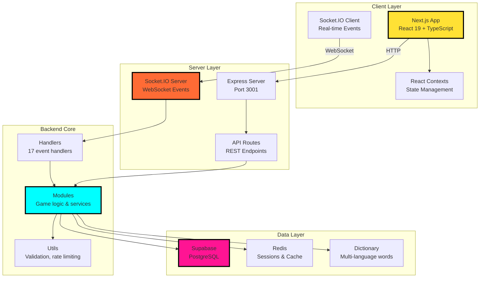

# AGENTS.md
This file provides guidance to Verdent when working with code in this repository.

## Table of Contents
1. [Commonly Used Commands](#commands)
2. [High-Level Architecture & Structure](#architecture)
3. [Key Rules & Constraints](#key-rules--constraints)
4. [Development Hints](#development-hints)

## Commands

**Working Directory**: All commands run in `fe-next/` unless specified otherwise.

### Development
- `npm run dev` - Start dev server (cleans .next, runs Express + Next.js on port 3001)
- `npm run dev:bun` - Alternative dev server using Bun runtime
- `npm run clean` - Remove .next build cache

### Build & Start
- `npm run build` - Production build (builds schemas first, then Next.js app)
- `npm run build:analyze` - Build with bundle size analysis (opens treemap)
- `npm run start` - Production server (Express + Next.js)
- `npm run start:bun` - Production server using Bun runtime

### Testing
- `npm run test` - All tests (backend + frontend)
- `npm run test:backend` - Jest backend tests only
- `npm run test:frontend` - Jest frontend tests only
- `npm run test:watch` - Interactive watch mode
- `npm run test:coverage` - Coverage report
- `npm run test:e2e` - Playwright E2E tests
- `npm run test:e2e:ui` - Playwright UI mode
- `npm run test:e2e:headed` - Playwright headed browser mode
- `npm run stress` - Load test (100 clients, 30s duration)

### Quality & Validation
- `npm run lint` - ESLint validation
- `npx tsc --noEmit` - TypeScript type checking (no output)
- `npm run check:translations` - Verify translation completeness

### Database
- `npm run db:migrate` - Run Supabase migrations
- `npm run db:migrate:check` - Dry-run migration check

### CI/CD
CI runs in this order: `install → [lint, type-check, test] → build → bundle-analysis`

**Single test file**:
```bash
npm run test:backend -- backend/__tests__/scoringEngine.test.js
npm run test:frontend -- __tests__/MyComponent.test.tsx
```

## Architecture

### System Overview
**LexiClash** is a full-stack multiplayer word game (Boggle variant) with:
- **Frontend**: Next.js 16 + React 19 + TypeScript
- **Backend**: Express 5 + Socket.IO (WebSocket)
- **Database**: Supabase (PostgreSQL) + Redis (session/real-time state)
- **Languages**: Hebrew (RTL), English, Swedish, Japanese
- **Deployment**: Docker, Railway, Render

### Subsystems & Responsibilities



### Directory Structure

```
fe-next/
├── app/[locale]/          # Next.js App Router (i18n routing)
├── components/            # 93 React components
│   ├── drills/           # Game mode UI (ComboMaster, LightningRound, etc.)
│   ├── game/             # Core game components
│   └── admin/            # Admin dashboard
├── backend/
│   ├── handlers/         # 17 WebSocket event handlers
│   ├── modules/          # 32+ game logic modules
│   ├── routes/           # 11 REST API routes
│   ├── utils/            # Validation, rate limiting, logging
│   ├── config/           # Configuration files
│   ├── data/             # Static game data
│   └── dictionary.ts     # Multi-language word dictionaries
├── server/               # Express server modules
│   ├── index.ts          # Server orchestration
│   ├── middleware.ts     # CORS, security headers
│   ├── socketSetup.ts    # Socket.IO configuration
│   ├── lifecycle.ts      # Startup/shutdown logic
│   └── healthRoutes.ts   # Health checks
├── hooks/                # 72 custom React hooks
├── contexts/             # 12 React Context providers
├── translations/         # i18n (he, en, sv, ja)
├── lib/                  # Library utilities
├── utils/                # Frontend utilities
├── e2e/                  # 42 Playwright test files
└── __tests__/            # Jest unit tests
```

### Key Data Flows

**1. Game Lifecycle**
```
Player joins → WebSocket connect → connectionHandler
  → playerJoinHandler → gameStateManager
  → gameLifecycleHandler → scoreManager
  → wordHandler → scoringEngine → leaderboardRoutes
```

**2. Real-time Communication**
```
Client Socket.IO event → socketHandlers.ts dispatcher
  → handler (e.g., chatHandler, gameHandler)
  → module logic (e.g., gameStateManager)
  → Redis state update → Socket.IO broadcast
```

**3. Request/Response Lifecycle**
```
HTTP Request → Express middleware → API route
  → backend module → Supabase/Redis query
  → validation (Zod schemas) → response
```

### External Dependencies
- **Supabase**: User auth, leaderboards, game history, admin data
- **Redis**: Real-time session state, pub/sub for horizontal scaling
- **Socket.IO**: WebSocket transport with fallback
- **Vertex AI**: AI hints for gameplay assistance [inferred]
- **Sentry**: Error tracking and monitoring
- **LogRocket**: Session replay and analytics [inferred]
- **Resend**: Email notifications [inferred]

### Development Entry Points
- **Frontend development**: `app/[locale]/page.tsx` (home), `components/` for UI
- **Backend development**: `backend/handlers/` for events, `backend/modules/` for logic
- **API development**: `backend/routes/` for new REST endpoints
- **Server configuration**: `server/index.ts` and `server/*.ts` modules
- **Testing**: `__tests__/` (frontend), `backend/__tests__/` (backend), `e2e/` (E2E)

## Key Rules & Constraints

### From CLAUDE.md (Critical - Read Before Changes)

**Translation-First Development**
- ALL UI text MUST use `t('key')` from LanguageContext - NO hardcoded strings
- Every feature requires translations in 4 languages: Hebrew (RTL), English, Swedish, Japanese
- Use `npm run check:translations` to verify completeness
- Translation keys follow pattern: `section.component.element` (e.g., `game.lobby.startButton`)

**Design System (Neo-Brutalist "Jackbox Party Pack" Style)**
- Dark-only theme - no light mode
- Hard shadows with NO blur: `shadow-hard`, `shadow-hard-lg` (e.g., `4px 4px 0px black`)
- RTL shadows auto-flip for Hebrew (`-4px 4px 0px`)
- Chunky borders: `border-neo` (3px), `border-neo-thick` (4px)
- Color palette: `neo-yellow`, `neo-orange`, `neo-pink`, `neo-cyan`, `neo-navy`, `neo-white`
- Typography: Fredoka (display), Rubik (body)
- Animation classes: `animate-neo-press`, `animate-neo-pop`, `animate-neo-wobble`, `animate-neo-shake`

**Container Queries Over Viewport Units**
- Prefer `cqw`, `cqh`, `cqi`, `cqb` over `vw`, `vh` for component responsiveness
- Setup: `container-type: inline-size` or `container: name / inline-size`
- Tailwind: `@container/name:text-lg`, `text-[3cqw]`

**Code Quality (Zero-Tolerance)**
- **NO `any` types** - Full type safety mandatory
- **Modular files** - Max 500 lines per file, split larger components
- **DRY principle** - Extract repeated logic to utilities/hooks
- **No magic strings** - Use constants for repeated strings
- **SOLID principles** - Single responsibility, max 50 lines per function
- **Error handling** - No empty catch blocks, all errors logged
- **Comments** - Write "why" not "what", delete commented-out code

**Testing (Mandatory)**
- Every new component/feature MUST have tests
- Run `npm run lint` after writing code
- Run relevant tests after implementation
- Verify `npm run build` succeeds
- **Test failure protocol**: If a test fails, analyze if it's a bug in code (fix code, NOT test)

**Investigation Protocol**
- NEVER apply quick patches without understanding root cause
- Trace full data flow before fixing
- Get confirmation before implementing fixes

**Persona: Senior Principal Engineer**
- Analyze architecture before acting
- Reject ambiguous requests - ask clarifying questions
- Challenge anti-patterns - suggest correct approach
- No "vibe coding" - code must be demonstrably correct
- Output format: plan → diff → verification (no "Here is the code" preambles)

### From README/Documentation

**Performance Constraints** [inferred from PERFORMANCE_AUDIT.md existence]
- Monitor bundle sizes with `npm run build:analyze`
- CI fails on bundle size regressions
- Keep initial load under performance budget

**Security**
- All inputs validated on BOTH frontend AND backend (Zod schemas)
- Rate limiting: 50 messages per 10 seconds default
- Profanity filtering via `bad-words` library
- No secrets in code - use environment variables
- Sanitize all user-generated content

**Accessibility**
- WCAG 2.1 AA compliance mandatory
- RTL support for Hebrew interface
- Keyboard navigation support
- Semantic HTML with ARIA labels

**Development Workflow**
- Husky pre-commit hooks enforce quality gates
- CI/CD runs: translations check → lint → type-check → tests → build
- All PRs must pass CI before merge
- Branch protection on `master`

## Development Hints

### Adding a New API Endpoint

1. **Create route file**: `backend/routes/myFeature.ts`
   ```typescript
   import { Router } from 'express';
   import type { Request, Response } from 'express';
   
   const router = Router();
   
   router.get('/api/my-feature', async (req: Request, res: Response) => {
     // Implementation
   });
   
   export default router;
   ```

2. **Register in server**: `server/index.ts`
   ```typescript
   import myFeatureRoutes from '../backend/routes/myFeature';
   app.use('/api', myFeatureRoutes);
   ```

3. **Add validation**: Use Zod schemas in `backend/utils/schemas.ts`

4. **Add tests**: Create `backend/__tests__/myFeature.test.ts`

5. **Update rate limits**: Adjust in `backend/utils/apiRateLimiter.ts` if needed

### Adding a WebSocket Event Handler

1. **Create handler**: `backend/handlers/myHandler.ts`
   ```typescript
   import type { Socket } from 'socket.io';
   
   export function handleMyEvent(socket: Socket, data: any) {
     // Validate with Zod
     // Update game state
     // Emit to room/broadcast
   }
   ```

2. **Register in dispatcher**: `backend/socketHandlers.ts`
   ```typescript
   import { handleMyEvent } from './handlers/myHandler';
   socket.on('myEvent', (data) => handleMyEvent(socket, data));
   ```

3. **Add to client**: Create/update hook in `hooks/useMyFeature.ts`

4. **Add tests**: `backend/__tests__/myHandler.test.js`

### Adding a New Game Mode/Drill

1. **Create component**: `components/drills/MyGameMode.tsx`
   - Import `useLanguage` for translations
   - Use Neo-Brutalist design system classes
   - Keep under 300 lines (split if needed)

2. **Add translations**: Update all 4 language files
   ```javascript
   // translations/en.js, he.js, sv.js, ja.js
   drills: {
     myGameMode: {
       title: 'My Game Mode',
       instructions: '...',
       // ...
     }
   }
   ```

3. **Create hook**: `hooks/useMyGameMode.ts` for game logic

4. **Add route**: `app/[locale]/drills/my-game-mode/page.tsx`

5. **Register in navigation**: Update drill selection component

6. **Add tests**:
   - `__tests__/MyGameMode.test.tsx` (component)
   - `backend/__tests__/myGameMode.test.js` (logic)
   - `e2e/myGameMode.spec.ts` (E2E flow)

### Modifying CI/CD Pipeline

**Location**: `.github/workflows/ci.yml`

**Structure**:
```
install (caches node_modules)
  ↓
[lint, type-check, test] (parallel)
  ↓
build
  ↓
bundle-analysis
  ↓
ci-success (summary)
```

**Adding a new check**:
1. Add job after `install`, before `build`
2. Include in `ci-success` needs array
3. Update summary in `ci-success` steps
4. Test in PR before merging

**Caching**: Uses `v1-deps-${{ runner.os }}-${{ hashFiles }}` pattern

### Extending Subsystems

**Adding a new module** (`backend/modules/`):
1. Create `myModule.ts` with single responsibility
2. Export typed functions (no classes unless state needed)
3. Import in handler/route that uses it
4. Add to `backend/__tests__/myModule.test.js`

**Adding a new context** (`contexts/`):
1. Create `MyContext.tsx` with provider + hook
2. Follow existing pattern: `createContext` + `useContext` export
3. Wrap in `app/[locale]/layout.tsx` if global
4. Add TypeScript types for state/actions

**Adding a new utility** (`utils/` or `backend/utils/`):
1. Create focused utility file (one responsibility)
2. Full TypeScript types
3. Export pure functions (stateless preferred)
4. Add unit tests
5. Document edge cases in JSDoc

### Translation Management

**Adding new keys**:
1. Add to all 4 files: `translations/{en,he,sv,ja}.js`
2. Run `npm run check:translations` to verify
3. For RTL (Hebrew), test rendering in browser
4. Use nested structure: `section.component.element`

**Finding missing translations**:
```bash
npm run check:translations
# Outputs report of missing keys per language
```

### Database Migrations

**Location**: `supabase/migrations/`

**Running migrations**:
```bash
npm run db:migrate              # Apply all pending
npm run db:migrate:check        # Dry-run validation
```

**Creating new migration**:
1. Create SQL file: `supabase/migrations/YYYYMMDDHHMMSS_description.sql`
2. Test locally with `db:migrate:check`
3. Migrations run automatically in CI (via `postbuild` hook)

### Debugging WebSocket Issues

1. **Check connection**: `server/socketSetup.ts` logs connections
2. **Monitor events**: Enable Socket.IO debug: `DEBUG=socket.io* npm run dev`
3. **Redis state**: Check `redisClient.ts` for state sync
4. **Rate limiting**: `backend/utils/rateLimiter.ts` may block rapid events
5. **Client-side**: Use browser DevTools → Network → WS tab

### Performance Optimization

1. **Bundle analysis**: `npm run build:analyze` → Opens treemap
2. **Top chunks**: CI reports largest chunks in summary
3. **Code splitting**: Use dynamic imports: `const Comp = dynamic(() => import('./Comp'))`
4. **Memoization**: Use `useMemo`/`useCallback` for expensive operations
5. **Virtual scrolling**: Use `@tanstack/react-virtual` for long lists (already installed)

### Docker Development

**Build**: `docker build -f Dockerfile -t lexiclash .`

**Run**: `docker-compose up` (runs both production and dev services)

**Bun variant**: `docker build -f Dockerfile.bun -t lexiclash-bun .`

**Environment**: Copy `.env.example` to `.env` and configure before running

---

**Last Updated**: 2026-01-11
**Primary Reference**: Always read `fe-next/CLAUDE.md` before making changes - it contains detailed coding standards and design system specifications.
